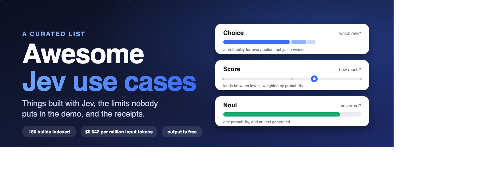

<p align="center">
  
</p>

<p align="center">
  <a href="https://awesome.re"></a>
  <a href="https://makeapullrequest.com"></a>
  <a href="LICENSE"></a>
</p>

# Awesome Jev use cases

A list of things built with Jev, TypeSafe's model for typed decisions, with the numbers behind them: who posted each demo, how many followers they have, how many likes it got, and what the limits of the model are. This list is unofficial and is not affiliated with TypeSafe.

Every entry links to the original post or repository. Ideas that nobody has shipped are in their own section and marked as ideas.

## Contents

- [The first week in numbers](#the-first-week-in-numbers)
- [Most-liked demos](#most-liked-demos)
- [Small accounts, big results](#small-accounts-big-results)
- [More demos by area](#more-demos-by-area)
- [Open source](#open-source)
- [By the maintainer](#by-the-maintainer)
- [What Jev is](#what-jev-is)
- [Cookbooks from TypeSafe](#cookbooks-from-typesafe)
- [Patterns](#patterns)
- [Limits of Jev 1.13](#limits-of-jev-113)
- [Reported cost and latency](#reported-cost-and-latency)
- [Ideas nobody has shipped yet](#ideas-nobody-has-shipped-yet)
- [Tools](#tools)
- [How this list was made](#how-this-list-was-made)
- [Contributing](#contributing)

## The first week in numbers

Snapshot of 2026-09-19.

- 74 demo posts with video, published between 2026-09-15 and 2026-09-19, with 127,162 likes combined.
- 102 builder accounts checked. The median has 6,615 followers. 47 have under 5,000 and 26 have under 1,000.
- 37 open-source repositories below, with 21,456 GitHub stars combined. Each one mentions Jev or TypeSafe in its own README.
- The four most-liked demos are a Claude Code plugin, a browser agent, an ad teardown and a Mac voice assistant. None of them generates text with Jev.

## Most-liked demos

The 15 demo posts with the most likes, with the follower count of whoever posted them. Numbers are a snapshot of 2026-09-19.

| Demo | By | Followers | Likes | Reposts |
| --- | --- | --- | --- | --- |
| [Instant compaction for Claude](https://x.com/tamarajtran/status/2100694549362553153) | [@tamarajtran](https://x.com/tamarajtran) | 12,739 | 10,435 | 631 |
| [Flight search with Browser Use](https://x.com/gregpr07/status/2100411066966749359) | [@gregpr07](https://x.com/gregpr07) | 30,060 | 8,723 | 617 |
| [Real-time slop detector as you scroll](https://x.com/RBilgil/status/2100976648552169805) | [@RBilgil](https://x.com/RBilgil) | 685 | 7,180 | 210 |
| [724 competitor ads, broken down](https://x.com/TheMattBerman/status/2100654891756589230) | [@TheMattBerman](https://x.com/TheMattBerman) | 12,799 | 6,348 | 389 |
| [Voice-controlled computer use on a Mac](https://x.com/instantricecook/status/2100814590300889426) | [@instantricecook](https://x.com/instantricecook) | 1,015 | 5,016 | 252 |
| [jev-trader](https://x.com/jarrodwatts/status/2100356151468585346) | [@jarrodwatts](https://x.com/jarrodwatts) | 32,542 | 4,913 | 216 |
| [Jev plays Doom](https://x.com/CompleteSkeptic/status/2099925687465570372) | [@CompleteSkeptic](https://x.com/CompleteSkeptic) | 122,369 | 4,890 | 240 |
| [A canvas you control by pointing and speaking](https://x.com/jackcheng/status/2100729670991802386) | [@jackcheng](https://x.com/jackcheng) | 11,724 | 4,797 | 254 |
| [Jev plays Subway Surfers](https://x.com/_MaxBlade/status/2100634359099232678) | [@_MaxBlade](https://x.com/_MaxBlade) | 22,962 | 3,956 | 253 |
| [A real-time ad blocker](https://x.com/iam_zachi/status/2100529273186472318) | [@iam_zachi](https://x.com/iam_zachi) | 4,832 | 3,872 | 139 |
| [500 emails for 3.5 cents](https://x.com/rileybrown/status/2100404532119269426) | [@rileybrown](https://x.com/rileybrown) | 244,870 | 3,853 | 96 |
| [Jev plays Smash Bros. against itself](https://x.com/maubaron/status/2100738237237002706) | [@maubaron](https://x.com/maubaron) | 19,783 | 3,620 | 334 |
| [Triage across 1,500 emails](https://x.com/ryanvogel/status/2100042788851101842) | [@ryanvogel](https://x.com/ryanvogel) | 18,403 | 3,538 | 106 |
| [700 leads scored in 40 seconds](https://x.com/romanbuildsaas/status/2100891604735099103) | [@romanbuildsaas](https://x.com/romanbuildsaas) | 20,336 | 3,138 | 203 |
| [Jev plays Super Mario Bros.](https://x.com/faadilhshaik/status/2100086301894881578) | [@faadilhshaik](https://x.com/faadilhshaik) | 192 | 2,860 | 248 |

## Small accounts, big results

Likes divided by followers, for demos with at least 1,000 likes. A high ratio means the post traveled far beyond the author's own audience.

| Demo | By | Followers | Likes | Likes per follower |
| --- | --- | --- | --- | --- |
| [Jev plays Super Mario Bros.](https://x.com/faadilhshaik/status/2100086301894881578) | [@faadilhshaik](https://x.com/faadilhshaik) | 192 | 2,860 | 14.9x |
| [Real-time slop detector as you scroll](https://x.com/RBilgil/status/2100976648552169805) | [@RBilgil](https://x.com/RBilgil) | 685 | 7,180 | 10.5x |
| [Voice-controlled computer use on a Mac](https://x.com/instantricecook/status/2100814590300889426) | [@instantricecook](https://x.com/instantricecook) | 1,015 | 5,016 | 4.9x |
| [jevlike](https://x.com/vinnylarouge/status/2100170846346097083) | [@vinnylarouge](https://x.com/vinnylarouge) | 1,392 | 2,018 | 1.4x |
| [Game levels generated in real time](https://x.com/HugoDuprez/status/2100953089003921543) | [@HugoDuprez](https://x.com/HugoDuprez) | 3,151 | 2,614 | 0.8x |
| [Instant compaction for Claude](https://x.com/tamarajtran/status/2100694549362553153) | [@tamarajtran](https://x.com/tamarajtran) | 12,739 | 10,435 | 0.8x |

## More demos by area

The next tier by likes, grouped by what the demo does.

### Agents and computer use

- [Computer use without screenshots](https://x.com/milindlabs/status/2100631847155994852) by [@milindlabs](https://x.com/milindlabs). On-device segmentation and OCR convert the screen into text that Jev can read.
- [A chat bot with no LLM](https://x.com/CodingGarden/status/2100665210419950031) by [@CodingGarden](https://x.com/CodingGarden). A chat bot without an LLM. Jev chooses the tool and its arguments, so replies arrive instantly.
- [End-to-end tests run by agents](https://x.com/o_kwasniewski/status/2100966838905585687) by [@o_kwasniewski](https://x.com/o_kwasniewski). Open-source framework where agents run end-to-end tests for web and mobile apps.
- [A second-hand shopping agent](https://x.com/AlanDaitch/status/2100757989212754085) by [@AlanDaitch](https://x.com/AlanDaitch). Reads about 26 second-hand listings per minute and decides on each one in 406 ms.
- [Stagehand on a remote browser](https://x.com/kylejeong/status/2100622054945095934) by [@kylejeong](https://x.com/kylejeong). Runs Stagehand browser tasks on a remote browser at about a tenth of a cent per task.

### Games and real time

- [Game levels generated in real time](https://x.com/HugoDuprez/status/2100953089003921543) by [@HugoDuprez](https://x.com/HugoDuprez). Game levels get built on the fly while you play.
- [Jev plays Slay the Spire 2](https://x.com/coolish/status/2100570517954838897) by [@coolish](https://x.com/coolish). Jev plays Slay the Spire 2 at 0.7 seconds per move, where GPT-6 Astra ran slowly.

### Triage and routing

- [A model router on Jev](https://x.com/ephraimduncan/status/2100454070536351824) by [@ephraimduncan](https://x.com/ephraimduncan). Router that chooses the model best suited to each request and forwards it there.
- [400 companies matched to one candidate](https://x.com/sarvagya_kul/status/2100980770206879849) by [@sarvagya_kul](https://x.com/sarvagya_kul). Predicts which jobs one candidate is most likely to land across 400 companies, at $0.0005.
- [Intent-based search in Gmail](https://x.com/dabit3/status/2100960281769738433) by [@dabit3](https://x.com/dabit3). Gmail search that matches what you mean instead of the exact words you type.
- [Fraud detection with Jev and Kimi K3](https://x.com/nutlope/status/2100614659690713543) by [@nutlope](https://x.com/nutlope). Jev classifies 100 emails in 1.42 seconds and passes the uncertain ones to Kimi K3.
- [900 images in 40 seconds](https://x.com/fayazara/status/2100953838891192789) by [@fayazara](https://x.com/fayazara). Image classifier by Fayaz Ahmed. OCR reads each image and Jev sorts it, 900 images in 40 seconds.

### Trading and markets

- [$10,000 in Jev’s hands](https://x.com/abolbuild/status/2100523868913807410) by [@abolbuild](https://x.com/abolbuild). Abol handed Jev $10,000 and let it place trades on its own.

### Content and growth

- [Every’s editorial vibe check](https://x.com/danshipper/status/2099947471518474522) by [@danshipper](https://x.com/danshipper). Runs 21 questions over each of 37 documents. That is 1,709 judgments for under one cent.
- [Post scoring with SuperX](https://x.com/robj3d3/status/2100722975645598191) by [@robj3d3](https://x.com/robj3d3). Answers 61 questions about a draft post in about one second.
- [Doomscroll Filter](https://x.com/robj3d3/status/2101074194260000982) by [@robj3d3](https://x.com/robj3d3). You choose a niche and Jev sorts new X posts into Read, Skim or Pass.
- [The X algorithm, rebuilt with Jev](https://x.com/leojrr/status/2100470174130250127) by [@leojrr](https://x.com/leojrr). Rebuilds the X algorithm to estimate how far a post will reach, with a global feed of everyone's posts.
- [SEO and GEO fixes, 90% cheaper](https://x.com/irabukht/status/2101090579127951694) by [@irabukht](https://x.com/irabukht). Ryze AI agents that use Jev to audit a client's SEO and GEO and apply fixes at 90% lower cost.
- [Live viral post analyzer](https://x.com/rileybrown/status/2100425868053008758) by [@rileybrown](https://x.com/rileybrown). Gives a draft post a score half a second after you stop typing.
- [Ad creatives from filtered assets](https://x.com/higgsfield_ai/status/2101117855622463719) by [@higgsfield_ai](https://x.com/higgsfield_ai). Jev filters content and selects assets, then DeepSeek and Higgsfield turn them into ads.
- [3,282 posts, eight questions each](https://x.com/iannuttall/status/2100668908227162567) by [@iannuttall](https://x.com/iannuttall). Ian Nuttall ran eight questions on each of 3,282 posts in his X archive, for $0.1282.
- [TypeSafe Typewriter](https://x.com/stevekrouse/status/2100287368221659289) by [@stevekrouse](https://x.com/stevekrouse). Asks sixteen judgments about your text again on each keystroke.
- [Lurk](https://x.com/mxfp4/status/2101070906852298910) by [@mxfp4](https://x.com/mxfp4). Finds and tracks Reddit threads so your content can get cited by AI, at no cost.
- [Jev Detector](https://x.com/jozef_gherman/status/2100627898436571555) by [@jozef_gherman](https://x.com/jozef_gherman). AI slop detector that scans about 10,000 words in 2 seconds.

### Research and data

- [1kpapers](https://x.com/nutlope/status/2100426999546184123) by [@nutlope](https://x.com/nutlope). 1,018 AI papers grouped by topic for $0.08, then published as a website.
- [A visual reference finder](https://x.com/albicodes/status/2100720936852857271) by [@albicodes](https://x.com/albicodes). Returns 100 reference images from one prompt, drawn from sources like Cosmos and NASA.

### Apps and tools

- [jev() for PostgreSQL](https://x.com/iam_zachi/status/2100679300756435135) by [@iam_zachi](https://x.com/iam_zachi). A jev() function for PostgreSQL that searches a table in plain language, without an index or embeddings.
- [Keystroke oracle](https://x.com/dabit3/status/2100756930054504776) by [@dabit3](https://x.com/dabit3). Keystroke oracle, a predictive launcher and the first experiment in Nader Dabit's Jev series.
- [An always-on assistant with no wake word](https://x.com/_MaxBlade/status/2100967959879471519) by [@_MaxBlade](https://x.com/_MaxBlade). Always-on assistant with no wake word that separates commands for the computer from ordinary conversation.
- [Predictive spreadsheets](https://x.com/dabit3/status/2100780008193020049) by [@dabit3](https://x.com/dabit3). Name a column and Jev fills each row in about 100 ms.
- [A Downloads folder that sorts itself](https://x.com/marcelpociot/status/2100906882365788167) by [@marcelpociot](https://x.com/marcelpociot). macOS app that files your downloads by rules you set, with Jev as the only LLM.
- [Hide posts on X in plain language](https://x.com/marcelpociot/status/2100520134481735729) by [@marcelpociot](https://x.com/marcelpociot). Browser extension that hides or collapses X posts based on a rule you write in plain language.
- [YouTube sponsor skipper](https://x.com/tdinh_me/status/2100793777103466615) by [@tdinh_me](https://x.com/tdinh_me). Chrome extension that finds sponsor segments in YouTube videos and skips past them.
- [askjev.ai](https://x.com/waynesutton/status/2100487878992388279) by [@waynesutton](https://x.com/waynesutton). Website where you ask Jev anything and it gives a judgment instead of an answer.
- [Website to App](https://x.com/chddaniel/status/2100919415554617537) by [@chddaniel](https://x.com/chddaniel). Paste a URL and Jev decides how to rebuild that site as a native mobile app.
- [Jev Calc](https://x.com/thekitze/status/2100873520951808403) by [@thekitze](https://x.com/thekitze). A notebook-style calculator that understands terms written in plain language.

## Open source

Repositories with a working project and a README that mentions Jev or TypeSafe. Stars are a snapshot of 2026-09-19.

### Browser and computer use

- [browser-use/jev-ultrafast](https://github.com/browser-use/jev-ultrafast). Browser agent that picks an operation and element per step, with a small LLM writing text only when typing is needed. 7,798 stars, Python, MIT.
- [awlevin/typesafe-computer-use](https://github.com/awlevin/typesafe-computer-use). Drives a Mac toward a plain-English goal for about $0.0002 a step. It reads the screen with OCR and sends no screenshots. 456 stars, Python, MIT.
- [wy-coliney/jev-browser-use](https://github.com/wy-coliney/jev-browser-use). Browser skill where Jev handles navigation and clicks while Codex keeps text input and final checks. Built at EZCollegeApp. 176 stars, JavaScript, MIT.
- [jkudish/jev-browser](https://github.com/jkudish/jev-browser). Runs a real headless browser through an MCP server, a CLI or a library. It picks one action per step from the clickable elements on the page. 135 stars, TypeScript, MIT.
- [moritzkremb/jev-voice-browser](https://github.com/moritzkremb/jev-voice-browser). Node app controlling a headed Chromium window by voice. Jev picks intent and target on each partial transcript and Playwright acts. 110 stars, JavaScript, MIT.
- [droidrun/mobile-jev](https://github.com/droidrun/mobile-jev). Navigates a live Mobilerun phone with Jev. The demo opens Uber and enters a route in about 21 seconds for 9 actions. 209 stars, JavaScript, MIT.
- [realZachi/typesafe-adblock](https://github.com/realZachi/typesafe-adblock). Chrome extension that asks Jev whether a DOM element is an ad and removes it. A side project that needs your own key. 53 stars, JavaScript, MIT.
- [kitze/unclutter](https://github.com/kitze/unclutter). WXT browser extension that removes page clutter using Jev, with reusable template rules. 129 stars, TypeScript, MIT.

### Coding agents and developer tools

- [tamaratran/fast-jev-compaction](https://github.com/tamaratran/fast-jev-compaction). Claude Code plugin that scores each tool call and result at compaction, drops or truncates stale ones, and keeps the rest verbatim. 4,031 stars, TypeScript, MIT.
- [tamaratran/jev-pruner](https://github.com/tamaratran/jev-pruner). Claude Code plugin that trims noisy Bash output with Jev after a command runs and before the main model sees the result. 80 stars, TypeScript, MIT.
- [devagrawal09/jev-review](https://github.com/devagrawal09/jev-review). Staged code-review workflow and local dashboard that reviews a Git diff or a whole codebase using focused Jev calls. 326 stars, TypeScript, MIT.
- [thruwire/foreman](https://github.com/thruwire/foreman). Places Jev above slower coding agents to judge whether a Codex worker's implementation is complete for a ticket, spec or bug report. 359 stars, Python, MIT.
- [kitze/skillbox](https://github.com/kitze/skillbox). Self-hosted, versioned skills library for AI agents with MCP, scoped clients and optional Jev recommendations. 188 stars, TypeScript, MIT.
- [DevMortimer/pi-warden](https://github.com/DevMortimer/pi-warden). Guardrails for Pi that feed problems back to the agent. It judges irreversible or off-task tool calls, stuck loops and unverified done claims. 90 stars, TypeScript, MIT.
- [vinilana/jev-eval-agent](https://github.com/vinilana/jev-eval-agent). Compares how many steps an agent with 100 mocked tools needs to finish a task when the LLM picks tools versus Jev. 89 stars, HTML.
- [mrnugget/jev-shell-history](https://github.com/mrnugget/jev-shell-history). Zsh autosuggestions that have Jev rank your last 100 distinct history entries and show the best match in grey with its score. 63 stars, TypeScript.
- [vercel-labs/ai-cli](https://github.com/vercel-labs/ai-cli). Terminal tool that generates text and media through AI Gateway and can also evaluate typed questions. 805 stars, TypeScript.
- [RafalWilinski/vibecheck](https://github.com/RafalWilinski/vibecheck). Chrome extension that rates a draft X post for virality and clarity before you publish. 41 stars, JavaScript.

### Routing

- [gargpratyush/jev-router](https://github.com/gargpratyush/jev-router). Per-turn router for Claude Code and OpenAI Codex. Simple work goes to a fast tier and hard work to a strong tier. 191 stars, JavaScript, MIT.
- [BillionsBobby/JevRouter](https://github.com/BillionsBobby/JevRouter). Router that picks among models, subagents and tools from one candidate set. Jev answers a Choice question. Code enforces permissions. 81 stars, TypeScript, MIT.

### Data and search

- [realZachi/pg-jev](https://github.com/realZachi/pg-jev). PostgreSQL extension for asking your tables questions in plain language. 204 stars, Shell, NOASSERTION.
- [giuliosmall/pg_typesafe](https://github.com/giuliosmall/pg_typesafe). Pre-alpha PostgreSQL extension that calls Jev from SQL for categorical classification. Tested on PostgreSQL 16 and 17. 77 stars, C, MIT.
- [superagents-lab/jev-search](https://github.com/superagents-lab/jev-search). Web search where Jev picks sources, time ranges and search terms, then ranks Search1API results with visible scores. No generated answers. 199 stars, TypeScript, MIT.
- [pithings/advocaat](https://github.com/pithings/advocaat). Small type-safe client for asking questions about your data and getting typed answers in one request. 84 stars, TypeScript, MIT.

### Games, trading and hardware

- [fhshaik/typesafe-mario](https://github.com/fhshaik/typesafe-mario). Experimental controller where Jev picks NES inputs for Super Mario Bros. from compact emulator telemetry instead of screenshots. 278 stars, Python.
- [vinnylarouge/jevlike](https://github.com/vinnylarouge/jevlike). Trains a small model that takes text plus N options and returns one probability per option in a single pass. 961 stars, Python, MIT.
- [hr98w/jev-visual](https://github.com/hr98w/jev-visual). Educational Apple Silicon project using Qwen3.5-0.8B with MLX to answer several questions about one image via browser UI, CLI or HTTP API. 138 stars, Python, MIT.
- [jarrodwatts/jev-trader](https://github.com/jarrodwatts/jev-trader). Trading bot that asks Jev for a buy or sell decision each Monad block on the Kuru MON-USDC order book and posts a post-only limit order. 1,184 stars, TypeScript, MIT.
- [RomanSlack/jev-drone](https://github.com/RomanSlack/jev-drone). Simulated quadrotor flying a five-station MuJoCo obstacle course by camera alone, with Jev judging the situation at about 2.5 Hz. 71 stars, Python, MIT.

### Open models and alternatives

- [TheoLeeCJ/SemIf](https://github.com/TheoLeeCJ/SemIf). Semantic if-statements from open models on a home 3090 GPU, with a browser demo. Independent, not affiliated with TypeSafe. 1,839 stars, Python, MIT.
- [jaredpalmer/kev](https://github.com/jaredpalmer/kev). LoRA adapter and small readout head on a Qwen base that answers many typed questions about a document in one prefill pass. 423 stars, Python, Apache-2.0.
- [razorback16/openjev](https://github.com/razorback16/openjev). Open-source decision server that answers typed questions with probabilities and a confidence in tens of milliseconds. 113 stars, Python, Apache-2.0.
- [logan-markewich/jeff](https://github.com/logan-markewich/jeff). Self-hosted stand-in for the Jev API on a 400M-parameter GLiFormer, usable with the official SDK. Less accurate on reasoning-heavy tasks. 87 stars, Python, MIT.
- [Mapika/decider](https://github.com/Mapika/decider). Language model fine-tuned from Qwen3.5-2B that returns calibrated probabilities for typed questions in one forward pass and generates no text. 86 stars, Python, Apache-2.0.

### MCP, skills and clients

- [itsmostafa/typesafe-mcp](https://github.com/itsmostafa/typesafe-mcp). MCP server that lets coding agents such as Claude Code and Codex call Jev and get probabilities to branch on. 97 stars, Go, MIT.
- [jkudish/jev-mcp](https://github.com/jkudish/jev-mcp). MCP server giving agents ten Jev judgment tools, such as verifying claims against evidence and screening content before it enters context. 92 stars, TypeScript, MIT.
- [dbreunig/building-with-jev-skill](https://github.com/dbreunig/building-with-jev-skill). Agent skill for writing and improving Jev programs. It teaches question design and how to diagnose wrong answers. 113 stars.

## By the maintainer

- will-it-hit. A live LinkedIn draft scorer. One call asks eight Score questions (hook, specificity, emotion, clarity, repostability, authority, algorithm fit, expected engagement) and one Choice question for post type. The rubrics carry real engagement numbers from LinkedIn posts. A separate LLM writes rewrites, and Jev scores each rewrite again so you see both numbers. The source is in a private repository for now.
- linkedin-slop-blocker. A browser extension that scores every post in your LinkedIn feed as you scroll. Each post gets a "Slop" or "Not slop" pill with a percentage, and slop posts get a fading text treatment and a rotated SLOP stamp you can click away. That scroll style follows the [real-time slop detector demo](https://x.com/RBilgil/status/2100976648552169805) by @RBilgil. A free pattern scan runs first, then one Jev call per scroll returns a spam probability and a quality score for each post. It keeps your own API key in the browser and learns from posts you hide or dismiss. The source is in a private repository for now.

## What Jev is

Jev answers typed questions about a piece of context. You send one state (a string, an object, or an array) and a map of named questions to a single endpoint. There are three question types.

- Choice picks one option from a set you define and returns the probability of every option.
- Score rates the state on an ordered rubric and can land between two levels.
- Noul answers yes or no as a probability.

Jev does not generate text. Output tokens are free, and questions asked over the same state run in parallel. For anything that needs prose, pair it with a normal LLM.

The smallest request:

```bash
curl https://api.typesafe.ai/v1/systemone \
  -H "Authorization: Bearer $TYPESAFE_API_KEY" \
  -H "Content-Type: application/json" \
  -d '{
    "state": "Help! My payouts have been failing for 3 days.",
    "model": "jev-latest",
    "questions": {
      "is_urgent": {"type": "noul", "instructions": "Does this convey urgency?"}
    }
  }'
```

The [API reference](https://docs.typesafe.ai/api) shows this response for that request:

```json
{
  "model": "jev-latest",
  "answers": { "is_urgent": { "type": "noul", "noul": 0.92 } },
  "usage": { "input_tokens": 312, "output_tokens": 48 }
}
```

The [models page](https://docs.typesafe.ai/models) lists Jev 1.13 at $42 per billion input tokens, a limit of 250,000 tokens per second and 1,200 requests per minute, and a cap of 32k tokens on the state plus the longest question. The `model` value `jev-latest` currently points to `jev-1.13.0`.

## Cookbooks from TypeSafe

TypeSafe's own worked examples. Numbers below are the ones TypeSafe reports in each cookbook.

- [Parallel questions](https://docs.typesafe.ai/cookbooks/parallel_questions). Runs a 13-question regulatory briefing over one document. Batching every question into one call is reported as 12.2x cheaper and 10.0x faster with no change in answers.
- [Re-ranking](https://docs.typesafe.ai/cookbooks/rerank_typesafe). Asks one question per query and candidate pair on 30-passage shortlists for 40 legal queries. Top-1 accuracy goes from 5% to 18% and top-10 from 38% to 62%.
- [Line-by-line search](https://docs.typesafe.ai/cookbooks/semantic_find). Semantic search over GitHub's Terms of Service. One request scores 218 line ids against a plain-language query.
- [Structure recovery](https://docs.typesafe.ai/cookbooks/autoformat). Rebuilds Markdown from plain text that lost its formatting, in two requests.
- [Function calling](https://docs.typesafe.ai/cookbooks/function_calling). Turns natural-language trading requests into calls to ordinary typed functions.
- [Skill suggestion](https://docs.typesafe.ai/cookbooks/skill_suggestion). Picks at most one skill for an agent turn out of the 182 in Nous Research's Hermes catalog, and can reject every candidate.
- [Knowledge graph entity alignment](https://docs.typesafe.ai/cookbooks/entity_alignment). Decides which of 450 candidate pairs from two beer catalogues are the same product. One Score question carries the decision, and its levels are merge, leave unlinked, and hand to a curator.
- [Classifying RAG passages](https://docs.typesafe.ai/cookbooks/classifying_rag_passages). Scores each retrieved passage in one request, then code decides which ones reach the answering model. A passage carrying a hidden instruction can be dropped.
- [Double-checking citations](https://docs.typesafe.ai/cookbooks/citation_check). One Choice question decides whether the quote's context supports the claim, and low confidence flags the citation for review.
- [Guardrails for LLMs](https://docs.typesafe.ai/cookbooks/llm_guardrails). Screens every message going into and out of an LLM app with one request that scores hazards such as jailbreak attempts. Your code applies the thresholds.
- [SDE cascade](https://docs.typesafe.ai/cookbooks/sde_cascade). A two-stage structured-data-extraction cascade that gets most of a large reasoning model's quality at a fraction of the cost.
- [Date extraction](https://docs.typesafe.ai/cookbooks/date_extraction_cookbook). Asks Jev for the parts of a date named in a document, then resolves and validates them in code.
- [Pre-parsed value extraction](https://docs.typesafe.ai/cookbooks/pre_parsed_value_extraction_cookbook). Regexes find candidate emails, phone numbers, and amounts, then Jev selects the requested span so code can normalize it.
- [Hierarchical classification](https://docs.typesafe.ai/cookbooks/hierarchical_classification). Classifies documents through deep patent, retail product, biomedical, and source-code hierarchies with parallel beam search over Choice probabilities.
- [Autoresearch feature discovery](https://docs.typesafe.ai/cookbooks/autoresearch_feature_discovery). A loop that proposes questions, turns free text into numeric features, and uses model errors to improve a supervised CatBoost regressor.
- [Classification using confidence](https://docs.typesafe.ai/cookbooks/classification_using_confidence). Classifies SEC annual reports into 75 industry groups with one Choice each, then reads the answer's confidence to decide whether to report the group or the broader division above it.
- [Self-consistency with nouls](https://docs.typesafe.ai/cookbooks/consistency_noul_cookbook) and [with choices](https://docs.typesafe.ai/cookbooks/consistency_choice_cookbook). Route uncertain probabilities to human review, and add an uncertain outcome to moderation decisions.

## Patterns

From TypeSafe:

- [Speculative fan-out](https://docs.typesafe.ai/patterns/fan-out). Send many questions in one call. Speculative ones are fine, and your code decides what is relevant.
- [Confidence-gated routing](https://docs.typesafe.ai/patterns/confidence-routing). The answer tells you what, and confidence tells you whether to act.
- [Composite scoring](https://docs.typesafe.ai/patterns/composite-scoring). Break a complex judgment into atomic scores and combine them with weights you control in code.
- [Intent routing](https://docs.typesafe.ai/patterns/intent-routing). Classify incoming requests and send each to a deterministic handler, a specialist LLM, or a human.

Found while building the projects above:

- Generate with an LLM and judge with Jev. In 1kpapers the summaries cost $3.99 and the classification cost $0.08, so judging 1,018 papers cost about 50 times less than summarizing them. In will-it-hit, a separate LLM writes the rewrite because Jev cannot write text, and Jev then scores the result.
- Put many items in one state with one question per item. Send an array as the state, key the questions like `post_0` and `post_1`, and refer to items by path such as `posts[0]` in the instructions. One request covered a full feed scroll. The cost is accuracy, because TypeSafe's docs warn that unrelated material in the state lowers it. Keep batches small and check results by hand.
- Write rubrics from real outcomes. Score levels should describe concrete situations, and the instructions can carry observed numbers, such as how many reactions a flop and an outlier received, so scores do not drift upward.
- Do the arithmetic in code. will-it-hit combines its eight Score answers with fixed weights in code and uses thresholds for the verdict labels, which matches the advice on TypeSafe's limits page.
- Send requests from the extension's service worker. On linkedin.com a fetch from the page context to localhost failed in testing. A background service worker is not bound by the page's Content Security Policy.
- Select by test ids on LinkedIn, not class names. The feed uses hashed class names that change on every deploy. In September 2026 these worked: `div[role="listitem"][componentkey^="update-card-focus"]` for a post card, `[data-testid="expandable-text-box"]` for the body text, and the `aria-label` of `button[aria-label^="Open control menu for post by "]` for the author name. Expect them to break when LinkedIn changes its markup.

## Limits of Jev 1.13

From TypeSafe's [jaggedness page](https://docs.typesafe.ai/model-jaggedness/jev-1.13), last reviewed 2026-09-17, and the [models page](https://docs.typesafe.ai/models). Read the source pages before you build.

- It reads instructions literally. Write the exact condition and put boundary cases in the criteria.
- It is not a calculator. Keep math in code, which includes counting and date comparison, and use Jev to extract the parts.
- Use Score outputs for thresholds and ranking. Do not interpolate an exact number between two levels.
- Accuracy falls when the state carries content unrelated to the question. Filter first.
- Text in the state can steer the answer. An injected instruction or a misleading framing can move it, so test edge cases before deploying to many users.
- Separate questions are not guaranteed to agree. A Noul and a yes or no Choice about the same thing can return different numbers, so do not carry a threshold from one type to the other.
- It does not generate text. Use a generative model for that.
- English works best. Test other languages on your own content.
- The state plus the longest question is capped at 32k tokens and a whole request at 64k. Input is text only.

## Reported cost and latency

Except where a row names TypeSafe, these are numbers from the builders themselves and have not been independently verified.

| Source | Report |
| --- | --- |
| TypeSafe models page | $42 per billion input tokens ($0.042 per million). Output tokens are free. |
| [TypeSafe launch post](https://typesafe.ai/blog/introducing-system-one-models-and-jev) | End-to-end response time of 70 ms to 500 ms, and 40x to 200x faster than frontier LLMs on System One tasks. It says the 193.6x faster and 444.6x cheaper figures on its home page are on the higher end of real-world gains. |
| TypeSafe parallel-questions cookbook | 12.2x cheaper and 10.0x faster than one call per question, with the same answers, on one document. |
| [@nutlope](https://x.com/nutlope/status/2100426999546184123) | 8 cents to classify 1,018 papers, 256 ms median end-to-end per paper. The summaries from another model cost $3.99. |
| [@cjzafir](https://x.com/cjzafir/status/2100991512020725788) | $3.40 spent over 24 hours of testing. Repeats TypeSafe's 70 to 500 ms and 193.6x and 444.6x figures. |
| @walidboulanouar | About $0.001 spent across roughly 100k tokens in one day of building. |

## Ideas nobody has shipped yet

These are hypotheses from a brainstorm on 2026-09-19, not products. Where a documented limit applies, the note says so.

Consumer and content:

- A tone meter for any text box. Score clarity and tone as you type in Gmail, Slack, or X. The hard part is attaching to other sites' inputs without breaking them.
- Live chat moderation. Classify each message in a fast Twitch or Discord chat with Noul questions for toxicity and spam. Messages written to fool the classifier are the main risk.
- A feed reranker that asks only when unsure. Score every item in an infinite feed for interest fit and ask the user a question only when confidence is low.

Developer tools:

- A model router. Score prompt complexity and choose a model tier before the call, so the router costs less than the call it routes. Watch for flapping between tiers on near-identical prompts.
- CI test selection. Choose which test tier to run from a commit diff. Diffs are large, so filter to changed paths and hunks before sending them.
- Abuse scoring at an API gateway. Ask a Noul question about request text. Rates and timing must be computed in code. Request text is controlled by the attacker, so this is the riskiest idea here.

Browser extensions:

- A job board scam filter. Score each listing card as real, ghost, or scam. Selectors differ by site and change often.
- A marketplace price-trap detector. Flag likely bait listings, and compare prices in code instead of asking the model.
- A fake review flagger. Score each review as the list loads. Text alone is a weak signal for reviews written to look organic.

Operations:

- Support ticket triage. A Choice for department, a Score for urgency, and a Noul for refund requests. Calibrate the criteria on the client's own ticket history.
- Inbound lead scoring on form submit. Needs closed-won and closed-lost examples to calibrate the rubric.
- An outbound message compliance check. One Noul per policy rule in one request before send. Tune the confidence thresholds so false positives do not push people to turn it off.
- A CRM hygiene sweep. Score record quality and possible duplicates. A duplicate check needs both records in the state.

## Tools

- [TypeSafe skill for Claude Code](https://github.com/typesafe-ai/skills). Install with `claude plugin marketplace add typesafe-ai/skills`, then `claude plugin install typesafe@typesafe-ai`. It points the agent at TypeSafe's live docs.
- [Docs index for agents](https://docs.typesafe.ai/llms.txt). Every docs page with a one-line description.
- [Python SDK](https://docs.typesafe.ai/sdk/python) and [JavaScript SDK](https://docs.typesafe.ai/sdk/javascript).
- [Use case map](https://docs.typesafe.ai/concepts/use-case-map). TypeSafe's own list of use cases by industry.

## How this list was made

Snapshot taken 2026-09-19. Post metrics (likes, reposts, replies) come from the posts themselves, read with yt-dlp. Follower counts come from treg. Repository stars, languages and licenses come from the GitHub API, and every repository was opened to confirm its README mentions Jev or TypeSafe. Descriptions are written from the original posts and READMEs and checked so that no number appears that the source did not contain. Metrics change by the hour, so treat them as a dated snapshot. Followers are counted today, after most of these posts went out, so the follower ratios understate how small the accounts were at the time.

The two CSV files in [data](data) hold the same numbers.

## Contributing

Read [CONTRIBUTING.md](CONTRIBUTING.md), then open a pull request.

## License

[CC0 1.0](LICENSE)
